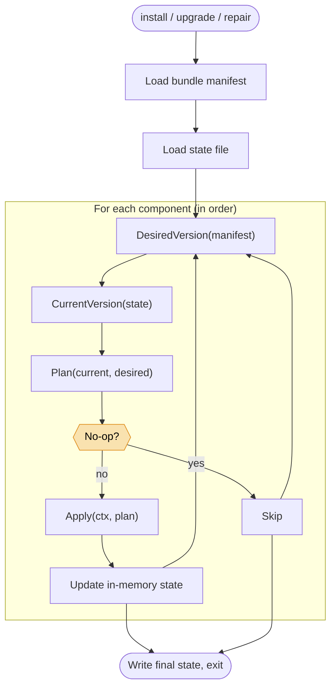

# Complete guide

Reference-grade detail on what the bootstrap does and what it touches. Start here when you need to understand a specific component, audit a host, or debug an unexpected state.

For a step-by-step quick start, see [Quick start](./quick-start.md). For the full CLI surface, see the [CLI reference](../reference/aether-ops-bootstrap/cli.md).

## The launcher at a glance

- **One binary.** Statically linked Go, `CGO_ENABLED=0`, ~20 MB.
- **Eight components.** `debs`, `ssh`, `sudoers`, `service_account`, `rke2`, `helm`, `onramp`, `aether_ops`.
- **One state file.** `/var/lib/aether-ops-bootstrap/state.json`.
- **One log file.** `/var/lib/aether-ops-bootstrap/bootstrap.log`.
- **One loop.** Every command runs the same component loop with different behaviour knobs (dry-run, repair, force).



`check` runs the same loop but stops after `Plan` — component actions are not applied.

## The rules the launcher follows

1. **No network, ever.** The launcher has no HTTP client for fetching artifacts. Everything it needs is in the bundle.
2. **Fail preflight before touching anything.** Unsupported Ubuntu, missing root, schema mismatch — these errors happen *before* any component runs.
3. **Idempotency by default.** Running the same bundle twice is a no-op.
4. **State is authoritative, not observation.** The launcher believes the state file over what it sees on disk. Use `repair` to reconcile.
5. **Use host-native tools for host-native semantics.** `dpkg`, `systemctl`, `useradd`, `groupadd`, and `visudo` are invoked where they own the platform behavior.
6. **Diagnostics on failure.** Any non-zero exit writes a diagnostic tarball to `/tmp`.

## Components

Every component implements the same four methods:

```go
type Component interface {
    Name() string
    DesiredVersion(b *bundle.Manifest) string
    CurrentVersion(s *state.State) string
    Plan(current, desired string) (Plan, error)
    Apply(ctx context.Context, plan Plan) error
}
```

- `Name()` — a stable identifier recorded in the state file.
- `DesiredVersion` — what the bundle wants. Read from `manifest.json`.
- `CurrentVersion` — what's on disk now. Read from `state.json`.
- `Plan(current, desired)` — returns a plan value. In 0.1.x, most components no-op when `current == desired`.
- `Apply(ctx, plan)` — actually do it.

Top-level commands walk the components in order, call `Plan`, and call `Apply` unless in dry-run mode. **Idempotency falls out naturally.**

### Install order

The launcher runs components in this order. It is not configurable — it reflects hard dependencies between components.

| # | Name | What it does |
|---|---|---|
| 1 | `debs` | Installs OS-level `.deb` prerequisites. |
| 2 | `ssh` | Writes `/etc/ssh/sshd_config.d/` drop-ins. |
| 3 | `sudoers` | Writes `/etc/sudoers.d/` drop-ins. |
| 4 | `service_account` | Creates the `aether-ops` service account and the `aether` onramp user. |
| 5 | `rke2` | Installs and starts RKE2. |
| 6 | `helm` | Installs the Helm binary. |
| 7 | `onramp` | Stages aether-onramp and Helm chart repositories for aether-ops. |
| 8 | `aether_ops` | Installs and starts the aether-ops daemon. |


### `debs`

Installs every `.deb` in `bundle/debs/` via `dpkg`.

**Touches:**

- Invokes `dpkg -i` on each file.
- System package database (`/var/lib/dpkg/`).
- Wherever the packages install (binaries in `/usr/bin`, etc.).

**Why first:** `git`, `make`, `ansible`, `curl`, and the rest are prerequisites for everything downstream, including aether-ops' own Ansible-driven operations.

**Exception:** `dpkg` is the one shelled-out tool. Reimplementing its maintainer scripts, triggers, alternatives, and PAM hooks in Go is out of scope. `dpkg` is part of Ubuntu's `Essential: yes` set and always present.

### `ssh`

Writes sshd drop-in files into `/etc/ssh/sshd_config.d/`.

**Touches:**

- `/etc/ssh/sshd_config.d/01-aether-password-auth.conf` — enables password authentication *only for the onramp user* via a `Match User` block.
- Other drop-ins as the templates dictate.

**Why before service accounts:** sshd is configured before the onramp user is created, so the first time that user logs in, sshd already accepts password auth for them.

The component restarts `ssh` or `sshd` after writing the drop-in so the new configuration is active.

### `sudoers`

Writes drop-in files into `/etc/sudoers.d/`.

**Touches:**

- `/etc/sudoers.d/<onramp_user>` — `NOPASSWD: ALL` for the Ansible deployment user.

All drop-ins are validated with `visudo -cf` before being moved into place; a broken sudoers file would lock out root access, so the launcher refuses to install one that doesn't parse.

### `service_account`

Creates the `aether-ops` OS user and group, and creates the onramp deployment user (default name `aether`).

**Touches:**

- Invokes `groupadd aether-ops` if the group doesn't exist.
- Invokes `useradd aether-ops` with system-account flags.
- Invokes `useradd <onramp_user>` with a login shell and home directory.
- Sets the onramp user's password on initial creation only.

The group membership is what lets `aether-ops` read RKE2's kubeconfig at mode `0640` in the `rke2` step.

The onramp user is **distinct from the service account**:

| | Service account (`aether-ops`) | Onramp user (`aether`) |
|---|---|---|
| Shell | `/usr/sbin/nologin` | `/bin/bash` |
| Home | None (system account) | `/home/aether` |
| Password | None | Set from the resolved onramp password |
| Sudo | None | `NOPASSWD: ALL` (via `/etc/sudoers.d/` drop-in) |
| Runs | The aether-ops daemon via systemd | Nothing — it's an identity, not a service |
| Used by | The daemon | Ansible connecting *into* the node |

The onramp password is resolved from `--onramp-password`, `AETHER_ONRAMP_PASSWORD`, the bundle spec, or — if none of those is set — a random string the installer generates and logs immediately. See the [CLI reference](../reference/aether-ops-bootstrap/cli.md#--onramp-password-value) for the exact precedence.

### `rke2`

Installs Rancher's Kubernetes distribution from the airgap tarballs in `bundle/rke2/`.

**Touches:**

- Extracts `rke2.linux-<arch>.tar.gz` under `/usr/local` (or `/opt/rke2` if `/usr/local` is read-only).
- Stages the airgap image tarball to `/var/lib/rancher/rke2/agent/images/`.
- Stages any bundled application image tarballs to the same airgap image directory.
- Writes `/etc/rancher/rke2/config.yaml` from a template. Notable entries:
  - `write-kubeconfig-mode: "0640"` — group-readable kubeconfig.
  - `write-kubeconfig-group: "aether-ops"` — service account can read it.
- Writes `/etc/profile.d/rke2.sh` — adds RKE2's bin dir to `PATH` and sets `KUBECONFIG` for interactive users.
- Enables and starts `rke2-server.service` via `systemctl`.
- Waits for `kubectl get nodes --no-headers` against `/etc/rancher/rke2/rke2.yaml` to return at least one node.
- Symlinks `/usr/local/bin/kubectl` to RKE2's bundled kubectl.
- Copies the kubeconfig to the onramp user's `~/.kube/config`.

**Why after service_account and before helm:** RKE2 needs the `aether-ops` group to exist so the kubeconfig mode `0640` / `group = aether-ops` permissions land on a real group. Helm and aether-ops both need RKE2 up before they're useful.

**Checksum verification:** every tarball fetched at build time has its SHA256 verified against the `sha256sum-<arch>.txt` from the RKE2 release.

### `helm`

Installs the Helm binary from `bundle/helm/`.

**Touches:**

- Extracts `helm-v*-linux-<arch>.tar.gz`.
- Writes `/usr/local/bin/helm` (executable, `0755`).

Helm is just a client binary here; it doesn't run as a service.

### `onramp`

Stages the aether-onramp Ansible toolchain and any bundled Helm chart repositories so aether-ops can deploy workloads fully offline.

**Touches:**

- `/var/lib/aether-ops/aether-onramp/`.
- `/var/lib/aether-ops/helm-charts/<name>/`.
- Ownership on those trees, set to `aether-ops:aether-ops`.

The onramp user (created by `service_account`) is the identity Ansible uses over SSH. The onramp component itself installs the content that aether-ops runs.

### `aether_ops`

Installs and starts the aether-ops daemon.

**Touches:**

- Writes the daemon binary (typically `/usr/local/bin/aether-ops`).
- Writes `/etc/systemd/system/aether-ops.service`.
- Creates `/etc/aether-ops/` and `/var/lib/aether-ops/`.
- Reloads systemd, enables and starts `aether-ops.service`.
- Waits for `http://127.0.0.1:8186/healthz` to return HTTP 200.

**Why last:** every other component is a prerequisite. When this one reports ready, the bootstrap's job is done and the launcher exits.

## On-disk layout

Every file the launcher reads or writes on the target host:

```
/usr/local/bin/
├── helm                                   # Helm binary
├── kubectl                                # symlink to RKE2's kubectl
└── aether-ops                             # aether-ops daemon binary

/var/lib/rancher/rke2/                     # RKE2 data directory
├── bin/kubectl, containerd, …             # RKE2 ships its own toolchain
└── agent/images/*.tar.zst                 # airgap images staged here

/etc/rancher/rke2/
├── config.yaml                            # written by launcher
└── rke2.yaml                              # kubeconfig, mode 0640, group aether-ops

/etc/systemd/system/
├── rke2-server.service                    # from RKE2 tarball
└── aether-ops.service                     # from bundle

/etc/aether-ops/
└── (created by launcher; runtime config may be added later)

/var/lib/aether-ops/
├── aether-onramp/                         # cloned at build, staged here
└── helm-charts/<name>/                    # per helm_charts: entry

/etc/ssh/sshd_config.d/
└── 01-aether-password-auth.conf           # Match User <onramp>

/etc/sudoers.d/
└── <onramp_user>                          # NOPASSWD: ALL

/etc/profile.d/
└── rke2.sh                                # PATH + KUBECONFIG for interactive shells

/var/lib/aether-ops-bootstrap/
├── state.json                             # state file (schema_version 1)
└── bootstrap.log                          # tee'd log from every run
```

### Users and groups created

| Name | Type | Purpose |
|---|---|---|
| `aether-ops` | system user + group | Service account running the aether-ops daemon. In the `aether-ops` group (which can read the kubeconfig). |
| `aether` (default) | human user + group | Onramp user for Ansible SSH. `NOPASSWD: ALL`. Password auth enabled only for this user. |

The onramp user's name is configurable via `aether_ops.onramp_user` in `bundle.yaml`.

### Network listeners the launcher *doesn't* own but expects

- `:22` — sshd. Must be running and accept connections for the onramp user.
- `:6443` — RKE2 Kubernetes API, after the `rke2` component finishes.
- `:8186` — aether-ops HTTP API and health endpoint in 0.1.x.

## State file

Lives at `/var/lib/aether-ops-bootstrap/state.json`. The schema:

```json
{
  "schema_version": 1,
  "launcher_version": "v0.1.43",
  "bundle_version": "2026.04.1",
  "bundle_hash": "",
  "roles": ["mgmt", "core"],
  "components": {
    "debs":            { "version": "2026.04.1",      "installed_at": "2026-04-18T14:27:11Z" },
    "rke2":            { "version": "v1.33.1+rke2r1", "installed_at": "2026-04-18T14:31:02Z" },
    "aether_ops":      { "version": "v0.1.43",        "installed_at": "2026-04-18T14:32:44Z" }
  },
  "history": [
    { "action": "install", "timestamp": "2026-04-18T14:32:44Z", "launcher_version": "v0.1.43", "bundle_version": "2026.04.1" },
    { "action": "upgrade", "timestamp": "2026-05-02T09:12:03Z", "launcher_version": "v0.1.44", "bundle_version": "2026.05.1" }
  ]
}
```

| Field | Description |
|---|---|
| `schema_version` | `1` for 0.1.x. Mismatch aborts preflight. |
| `launcher_version` | Version string of the launcher that last wrote this file. |
| `bundle_version` | Bundle calver last applied. |
| `bundle_hash` | Bundle hash recorded from the manifest. In 0.1.x this is usually empty. |
| `roles` | Roles selected on the last run (omitted when no `--roles` flag was passed). |
| `components` | Map from component name to `{ version, installed_at }`. |
| `history` | Append-only list of actions taken (`install` / `upgrade` / `repair` / `check`). |

The state file is the launcher's source of truth; it's authoritative over disk observation. The launcher writes state **atomically** (temp file + rename), so a crashed launcher leaves either the old or new file intact.

For idempotency, every `Plan` call compares the component's current version (from state) with the desired version (from the bundle manifest). If they match, the component is usually skipped. `repair` bypasses the check and re-applies regardless.

### Hand-editing state

Don't. The state file is not an operator interface. If you need to force re-application, use `repair`. The file is JSON and you have root, so it is *possible* to edit, but invalid JSON or an unrecognized `schema_version` will cause the next run to fail at preflight.

## Cleanup — reversing a bootstrap

There is no official "uninstall" command in 0.1.x. If you need to wipe a host:

```bash
# Stop services
sudo systemctl stop aether-ops rke2-server
sudo systemctl disable aether-ops rke2-server

# Uninstall RKE2 (their official script)
sudo /usr/local/bin/rke2-uninstall.sh

# Remove launcher-owned files
sudo rm -rf \
  /etc/aether-ops \
  /var/lib/aether-ops \
  /var/lib/aether-ops-bootstrap \
  /usr/local/bin/aether-ops \
  /usr/local/bin/kubectl \
  /etc/ssh/sshd_config.d/01-aether-password-auth.conf \
  /etc/sudoers.d/aether \
  /etc/profile.d/rke2.sh

# Reload services
sudo systemctl daemon-reload
sudo systemctl restart ssh

# Optionally remove users
sudo userdel aether-ops
sudo userdel aether
```

**Do not** do this to a production node.
