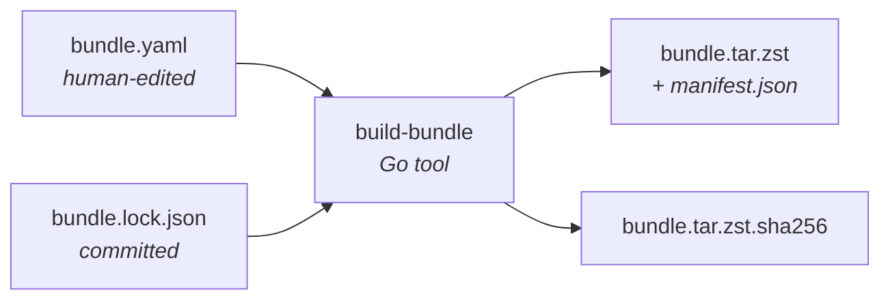

# Building a bundle

This section covers using [build-bundle](../tools/build-bundle.md) to produce the `bundle.tar.zst` payload that [aether-ops-bootstrap](../tools/aether-ops-bootstrap.md) installs onto target hosts. It also covers using [patch-bundle](../tools/patch-bundle.md) to make targeted edits to an already-built bundle.

## Who this section is for

- **Release engineers** cutting `v*` tags.
- **Integrators** maintaining a fork or producing site-specific bundles (internally mirrored `.deb`s, custom aether-ops builds, pinned RKE2 versions).
- **Operators** patching a bundle's onramp templates without a full rebuild.

If you're installing an already-built bundle on a host, you don't need this section — see [Bootstrapping → Quick start](../bootstrapping/quick-start.md) instead.

## The moving parts

- **[`bundle.yaml`](./bundle-yaml.md)** — the spec. Every build starts here.
- **[`bundle.lock.json`](./lockfile.md)** — pinned `.deb` versions and hashes, committed alongside the spec. The builder warns when the current resolution differs from the existing lockfile.
- **build-bundle** — the builder. Reads the spec, fetches and verifies artifacts, writes the lockfile, assembles the tarball, emits `manifest.json`.
- **[`manifest.json`](./manifest.md)** — the contract between builder and launcher. Lives *inside* the tarball.

## Pages in this section

| Page | What it covers |
|---|---|
| [Quick start](./quick-start.md) | The shortest path from `bundle.yaml` to `bundle.tar.zst` |
| [bundle.yaml reference](./bundle-yaml.md) | Every field in the spec |
| [Lockfile](./lockfile.md) | How `bundle.lock.json` works and when it changes |
| [Manifest](./manifest.md) | What's inside the produced bundle |
| [Versioning](./versioning.md) | Launcher semver, bundle calver, and the manifest schema |
| [Release process](./release-process.md) | What happens on `v*` tag push |
| [Patching a bundle](./patching.md) | Using patch-bundle for ad-hoc edits |

## What the builder refuses to do

- **Download anything at launcher runtime.** All fetching happens on the build machine; the launcher has no HTTP client for artifacts.
- **Hide lockfile drift.** If the lockfile exists and upstream `.deb` resolution has drifted, the builder logs a warning before rewriting it.
- **Publish unverified artifacts.** Every downloaded file is hashed and checked against its authoritative source (Ubuntu Packages index, GitHub release checksums, `get.helm.sh`).
